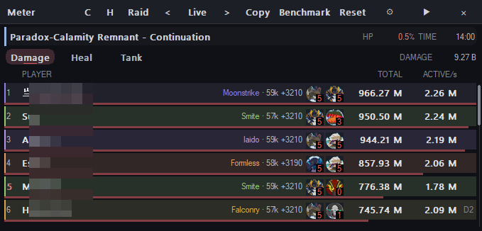
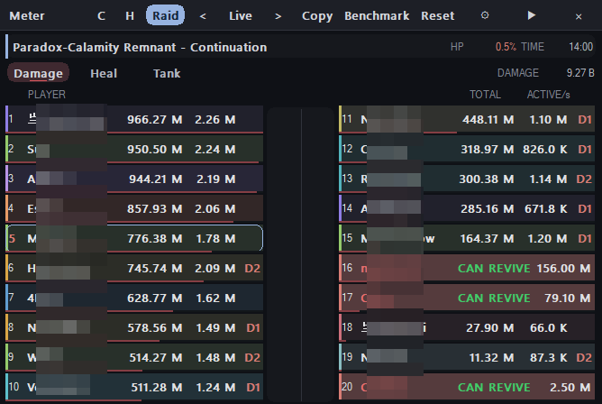
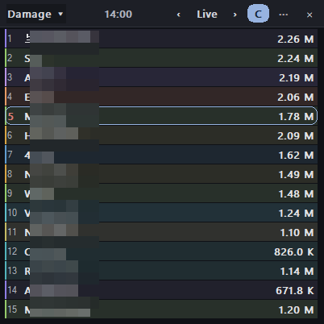
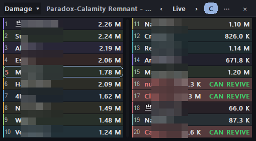
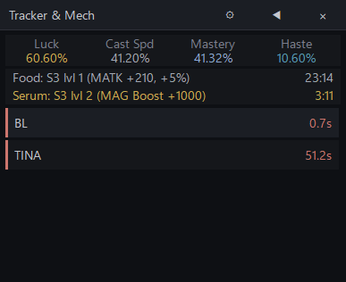
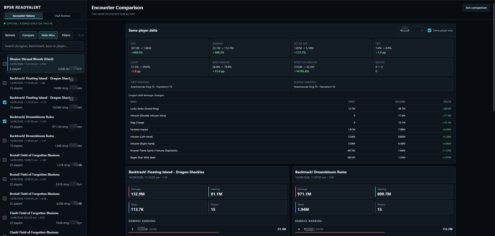
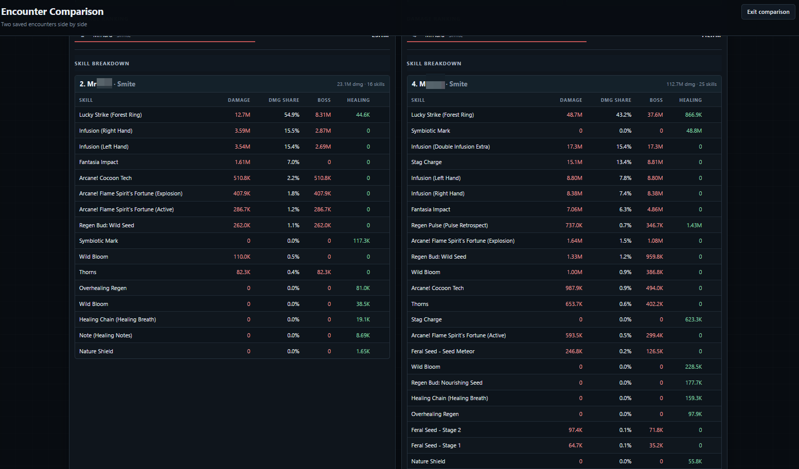
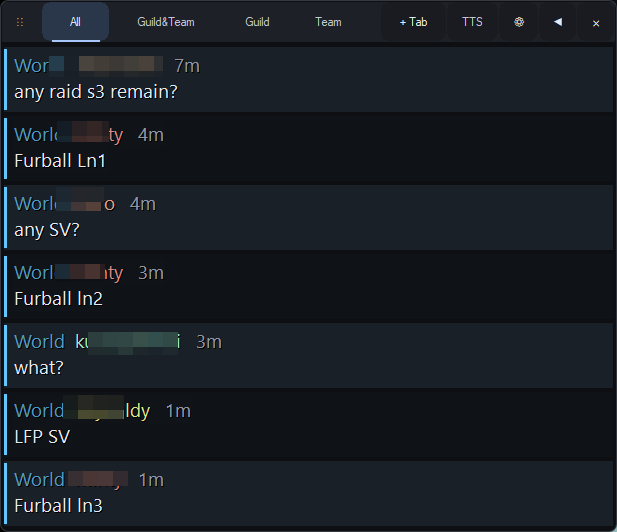

# BPSR ReadyAlert

A lightweight Windows combat companion for **Blue Protocol: Star Resonance**. See the information that matters during a fight without stacking multiple tools on top of the game.

[Download latest release](https://github.com/Zudin987/BPSR-ReadyAlert/releases/latest) · [Project website](https://zudin987.github.io/projects/readyalert/)

  
   
  <em>DPS meter - Normal mode</em>

## Why ReadyAlert?

ReadyAlert is more than a DPS meter. It puts combat information that is easy to miss, hard to calculate, or normally hidden behind extra UI steps directly into one lightweight companion.

- **Party Food & Serum tracking** - See other players' active Food and Serum activity.
- **Revive status** - Know at a glance who can and cannot be revived, including revive-penalty cases.
- **Imagine tiers without hovering** - View Imagine tier information directly from the combat UI.
- **Built-in Enrage tracker** - See how much time remains before the boss enrages.
- **Boss-specific Imagine mechanics** - Built-in trackers for mechanics such as TINA Basilisk and Kartgriff help you time Imagine casts correctly.
- **Encounter History** - Keep past encounters in a local archive, open them as HTML in your browser, and compare fights with Compare mode.
- **Very lightweight** - Built in Rust and packaged at around **10 MB**.
- **Chat translation** - Automatically detect non-English game chat and translate it to English.
- **Guild & Party TTS** - Optionally read Guild and Party chat aloud while you play.

## What it tracks

### Combat

- Damage, DPS and healing
- Tank and damage-received statistics
- Normal, Compact, Raid and Compact Raid layouts
- Encounter history and player inspection

### Party information

- Food and Serum activity
- Revive availability and revive penalties
- Imagine tier information

### Encounter mechanics

- Boss Enrage timer
- Dungeon and encounter mechanics
- Built-in Imagine timing helpers for supported encounters
- Food, Serum and Imagine tracking in one place

### Chat

- View-only game chat overlay
- Custom chat tabs
- Automatic non-English to English translation
- Optional Guild and Party text-to-speech

## Screenshots

<strong>Combat meter layouts</strong>

**Normal - full combat view**

  

**Raid - 20 players in two columns**

  

**Compact - essentials in less space**

  

**Compact Raid - 20 players in a smaller footprint**

  

<strong>Tracker & Mechanics</strong>

  

<strong>Encounter History</strong>

  
   
  <em>Encounter History - archive overview</em>

  
   
  <em>Encounter History - encounter details</em>

<strong>Chat Overlay</strong>

  

## Get started

**Requires:** 64-bit Windows and [Npcap](https://npcap.com/#download).

1. Install Npcap.
2. Download and run `BPSR-ReadyAlert.exe` from the latest release.
3. Open BPSR and enable the overlays and alerts you want in **Settings**.
4. If no game data appears, select the network adapter used by your game connection in **Settings**.

Press **Ctrl+Shift+F10** to show or hide the combat and mechanics overlays.

## Encounter History

ReadyAlert keeps encounters in a local archive that can be opened as HTML reports in your browser. Use **Compare** mode to place two encounters side by side and quickly spot differences in performance, party composition and fight context.

## Built for lightweight use

ReadyAlert is built in **Rust** and designed to stay small and responsive. The release is around **10 MB**, making it suitable as a background companion while you play.

## Chat without losing focus

The Chat Overlay can watch supported game chat channels and automatically translate non-English messages to English. Guild and Party chat can also be sent to TTS when enabled, so important messages can be heard without keeping the chat window in view.

## About

ReadyAlert reads game network traffic through Npcap. It does not inject into the game or automate gameplay. This is an unofficial community project.

[Build from source](docs/DEVELOPMENT.md) · [License](LICENSE) · [Third-party notices and credits](THIRD_PARTY_NOTICES.md)
